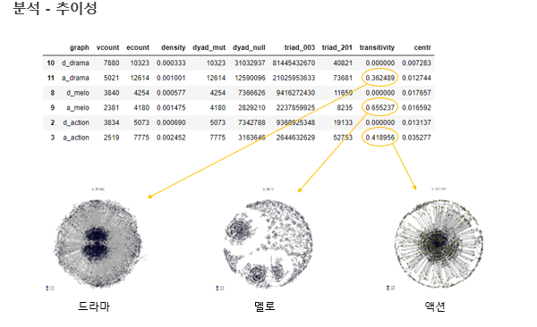

## 📌 프로젝트 개요
이 프로젝트는 **영화진흥위원회(KOBIS)** 오픈 API를 활용하여  
한국 영화 데이터(배우, 감독, 장르 등)를 수집하고,  
**배우와 감독 간의 관계도**를 시각적으로 표현하는 것을 목표로 하였습니다.  

## 📂 데이터 수집
- 데이터 출처: [KOBIS 영화진흥위원회](http://www.kobis.or.kr/kobis/business/mast/mvie/searchMovieList.do)
- 수집 방법: Python을 이용한 웹 크롤링 및 API 호출
- 수집 항목:
  - 영화명
  - 감독
  - 출연 배우
  - 장르
  - 제작 연도

## 🔍 데이터 전처리
- 중복 영화 제거
- 배우 이름 표준화
- 장르별 필터링 (액션, 로맨스, 코미디, 스릴러 등)

## 📊 시각화
- **NetworkX** 라이브러리를 활용하여 배우와 감독을 노드로,  
  출연/연출 관계를 엣지로 연결
- 장르별 네트워크 그래프 제작
- 노드 크기: 출연/연출 빈도
- 엣지 굵기: 함께 작업한 횟수

### 🎨 시각화 예시

## 🛠 사용 기술
- **Python**: 데이터 수집 및 전처리
- **Pandas**: 데이터프레임 처리
- **NetworkX** / **Matplotlib**: 관계도 시각화
- **Seaborn**: 장르별 통계 시각화

## 💡 기대효과
- 장르별 주요 감독과 배우 관계를 한눈에 파악 가능
- 협업 빈도가 높은 인물 파악을 통해 영화 산업 네트워크 분석 가능
